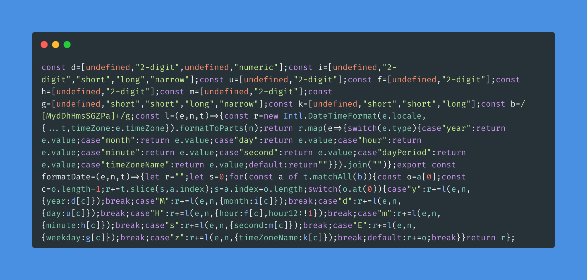

# intl-format-date

format date with `Intl.DateTimeFormat` and `formatToParts` method

----

> [!WARNING]
> THIS IS EXPERIMENTAL PROJECT
> You can use [zapier/intl-dateformat: Format a date using Intl.DateTimeFormat goodness.](https://github.com/zapier/intl-dateformat) instead of this project for actual use.


## Features



- Tiny size
- Internationalization

## Limitations

- Supported subset of Date Field Symbol Table
    - https://unicode.org/reports/tr35/tr35-dates.html

## Supported Date Field Symbol Table

| Symbol | Description | Example | Intl.DateTimeFormat         |
|--------|-------------|---------|-----------------------------|
| yyyy   | Year        | 2025    | `year: "numeric"`           |
| yy     | Year        | 25      | `year: "2-digit"`           |
| M      | Month       | 1       | `month: "numeric"`          |
| MM     | Month       | 01      | `month: "2-digit"`          |
| MMM    | Month       | Jan     | `month: "short"`            |
| MMMM   | Month       | January | `month: "long"`             |
| dd     | Day         | 01      | `day: "2-digit"`            |
| d      | Day         | 1       | `day: "numeric"`            |
| HH     | Hour        | 02      | `hour: "2-digit"`           |
| H      | Hour        | 2       | `hour: "numeric"`           |
| mm     | Minute      | 03      | `minute: "2-digit"`         |
| m      | Minute      | 3       | `minute: "numeric"`         |
| ss     | Second      | 04      | `second: "2-digit"`         |
| s      | Second      | 4       | `second: "numeric"`         |
| SSS    | Millisecond | 004     | `fractionalSecondDigits: 3` |
| Z      | Timezone    | +0900   | `timeZoneName: "short"`     |
| z      | Timezone    | JST     | `timeZoneName: "short"`     |
| E      | Day         | Mon     | `weekday: "short"`          |
| EEEE   | Day         | Monday  | `weekday: "long"`           |
| a      | Day Period  | AM      | `hour12: true`              |
| aaaa   | Day Period  | AM      | `hour12: false`             |

## Example

```ts
import { it } from "node:test";
import { formatDate } from "../src/index.ts";
import type { FormatContext } from "../src/index.ts";
import assert from "node:assert";

const testDate = new Date("2025-12-31T01:23:45.678Z");
const testDateContext: FormatContext = {
  locale: "en-US",
  timeZone: "UTC",
}
it("should format a string", () => {
  const result = formatDate(testDateContext, testDate, "yyyy-MM-dd HH:mm:ss");
  assert.strictEqual(result, "2025-12-31 01:23:45");
});
```

## Installation

- [ ] Describe the installation process

## Usage

- [ ] Write usage instructions

## Tests

- [ ] Write How to Tests

## Contributing

1. Fork it!
2. Create your feature branch: `git checkout -b my-new-feature`
3. Commit your changes: `git commit -am 'Add some feature'`
4. Push to the branch: `git push origin my-new-feature`
5. Submit a pull request :D

## License

MIT
